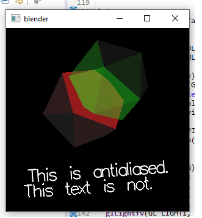

# A1 Report

Author: Jacob Cabral

Date: 2021-09-14(insert the date)

Check [readme.txt](readme.txt) for lab work statement and self-evaluation. 

## Q1 Concepts of raster graphics (short answer)
	
### Q1.1 frame buffer

A frame buffer is a memory area that holds the information needed to make the image line by line as the scan line moves down the screen

### Q1.2 pixel

A pixel is a small area of a screen that can be coloured with the electron beam of a CRT

### Q1.3 color depth

The number of bits used to define the color of a pixel

### Q1.4 resolution

The size of the image, measured in pixels per inch

## Q2 Concepts of raster display (short answer)
	
### Q2.1 scan line

A row in which the electron beam passes on.

### Q2.2 refreshment & refresh rate

refreshing is re-drawing the image on screen. Refresh rate refers to how often the program will refresh the image per second.

### Q2.3 frame

total screen area.

## Q3 Roles of CPU and GPU in CG (short answer)
	
### Q3.1 CPU roles

Write your answer here.

### Q3.2 GPU roles

CPU - Convert the instructions passed to it from a program into instructions for the gpu to execute
GPU - Free up the CPU from performing internsive graphics tasks and decides how to use the pixels to create the image

## Q4 C/C++ OpenGL programming environment (lab practice)
	
### Q4.1 C/C++ OpenGL installation
 
Complete? (Yes/No) 

If Yes, insert a screen shot image to show the completion.

{width=90%}

If No,  Add a short description to describe the issues encountered.

### Q4.2 OpenGL C project
 
Complete? (Yes/No) 

If Yes, insert a screen shot image to show the completion.

{width=90%}

If No,  Add a short description to describe the issues encountered.

### Q4.3 OpenGL C++ project
 
Complete? (Yes/No) 

If Yes, insert a screen shot image to show the completion.

{width=90%}

If No,  Add a short description to describe the issues encountered.

**References**

1. CP411 a1
2. Add your references if you used. 
