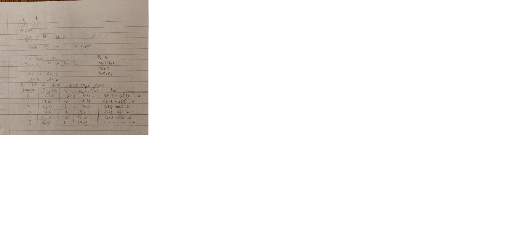
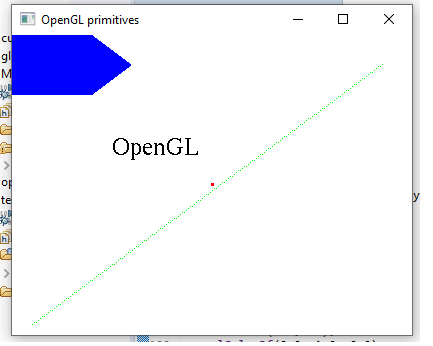
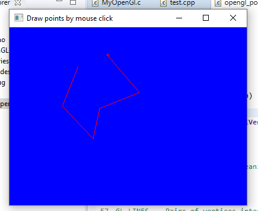
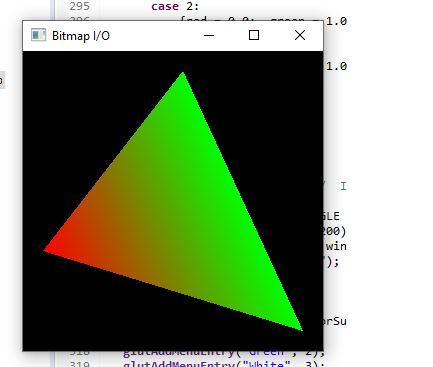
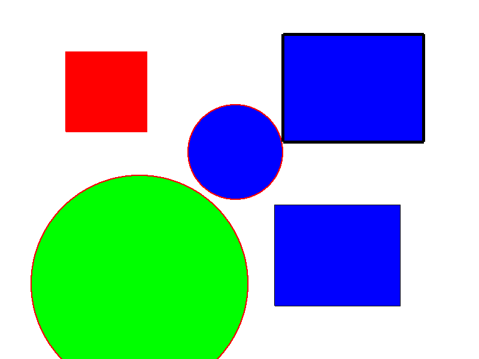

# A2 Report

Author: Jacob Cabral

Date: 2021-09-29

Check [readme.txt](readme.txt) for lab work statement and self-evaluation. 

## Q1 Graphics pipeline (short answer)
	
### Q1.1 Primitives

An object that is created through a program that is used to create more complex shapes.

### Q1.2 Coordinate systems & transformations

A coordinate system is a standardized grid created by the computer that allows for the placement of points to form primitives. they can be transformed in order to alter them. They are scaling, rotation and translation

### Q1.3 Scan conversion

Scan conversion is showing objects as pixels. Solution below

{width=90%}

## Q2 OpenGL and Glut (lab practice)
	
### Q2.1 OpenGL primitives
 
Complete? (Yes) 

If Yes, insert a screen shot image to show the completion.

{width=90%}

If No,  Add a short description to describe the issues encountered.

### Q2.2 Interactive graphics
 
Complete? (Yes) 

If Yes, insert a screen shot image to show the completion.

{width=90%}

If No,  Add a short description to describe the issues encountered.

### Q2.3 Bitmap file I/O
 
Complete? (Yes) 

If Yes, insert a screen shot image to show the completion.

{width=90%}

If No,  Add a short description to describe the issues encountered.

## Q3 SimpleDraw (programming)
	
### Q3.1 Display window and menu
 

Complete? (Yes) 

If Yes, insert a screen shot image to show the completion.

[image caption](images/window.png){width=90%}

### Q3.2 Data structures
 

Complete? (Yes) 

If Yes, insert a screen shot image to show the completion.

[image caption](images/demo.png){width=90%}

### Q3.3 Draw rectangles
 

Complete? (Yes) 

If Yes, insert a screen shot image to show the completion.

[image caption](images/rect.png){width=90%}

If No, add a short description to describe the issues encountered.

### Q3.4 Draw circles
 

Complete? (Yes) 

If Yes, insert a screen shot image to show the completion.

[image caption](images/circ.png){width=90%}

If No, add a short description to describe the issues encountered.

### Q3.5 Edit features
 

Complete? (Yes/No) 

If Yes, insert a screen shot image to show the completion.

[image caption](images/demo.png){width=90%}

Yes and no, did not have enough time to implement the move back and forward functions. 

### Q3.6 Save/Open SVG files

Complete? (Yes/No).   If Yes, [output.bmp](images/output.svg).
Can open, not save

### Q3.7 Export to bitmap

Complete? (Yes/No).   If Yes, .
This works!

### Q3.8 Circle&Square artwork

Complete? (Yes/No).   If Yes, [C&S artwork in SVG](images/c&s.svg), .
I can't save in SVG :( But I can save in bitmap! Please admite my beautiful art!

I really tried my best here, I am actually super intrested in CG but I didn't have enough time.

**References**

1. CP411 a2
2. Add your references if you used. 
