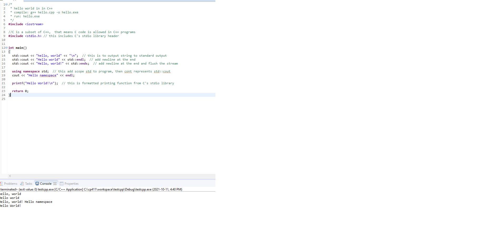
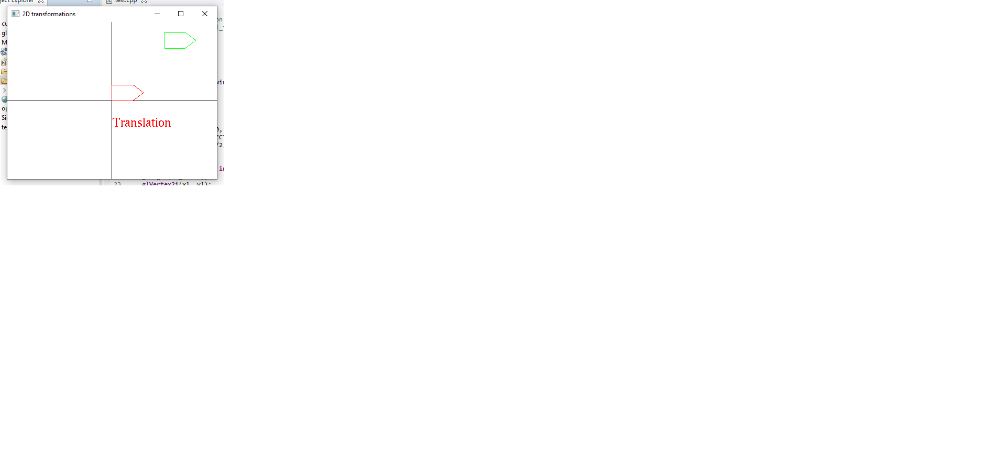

# A3 Report

Author: ??? (sign your name here)

Date: ???   (insert the date)

Check [readme.txt](readme.txt) for lab work statement and self-evaluation. 

## Q1 Graphics transformations (short_answer)

### Q1.1 Principle of transformations
	1)The basic transformations are translation, rotation and scaling. The composite transformations are a combination of basic transformations
	2)Homogenious systems are used in transformation computing because it allows for a universal standard for transformations that mesh with math.
### Q1.2 Hand on 2D transformations

## Q2 Graphics transformation programming (lab practice)
	
### Q2.1 Warm up C++
 
Complete? (Yes/No) 

If Yes, insert a screen shot image to show the completion.

{width=90%}

If No,  Add a short description to describe the issues encountered.

### Q2.2 2D transformations
 
Complete? (Yes/No) 

If Yes, insert a screen shot image to show the completion.

{width=90%}

If No,  Add a short description to describe the issues encountered.

### Q2.3 3D object and transformations
 
Complete? (Yes/No) 

If Yes, insert a screen shot image to show the completion.

{width=90%}

If No,  Add a short description to describe the issues encountered.

### Q2.4 Mesh object model
 
Complete? (Yes/No) 

If Yes, insert a screen shot image to show the completion.

{width=90%}

If No,  Add a short description to describe the issues encountered.

## Q3 SimpleView - transformations (programming)
	
### Q3.1 Create and render cube objects
 

Complete? (Yes) 

If Yes, insert a screen shot image to show the completion.

[image caption](images/shapes.png){width=90%}

If No, add a short description to describe the issues encountered.

### Q3.2 Create and render the pyramid object
 

Complete? (Yes) 

If Yes, insert a screen shot image to show the completion.

[image caption](images/pyrm.png){width=90%}

If No, add a short description to describe the issues encountered.

### Q3.3 Create and render the house object
 

Complete? (Yes/No) 

If Yes, insert a screen shot image to show the completion.

[image caption](images/demo.png){width=90%}

If No, add a short description to describe the issues encountered.

### Q3.4 MCS transforms
 

Complete? (Yes/No) 

If Yes, insert a screen shot image to show the completion.

[image caption](images/mcs.png){width=90%}

If No, add a short description to describe the issues encountered.

### Q3.5 WCS transforms
 

Complete? (Yes/No) 

If Yes, insert a screen shot image to show the completion.

[image caption](images/wcs.png){width=90%}

If No, add a short description to describe the issues encountered.

### Q3.6 VCS transforms
 

Complete? (Yes/No) 

If Yes, insert a screen shot image to show the completion.

[image caption](images/vcs.png){width=90%}

If No, add a short description to describe the issues encountered.

**References**

1. CP411 a3
2. Add your references if you used. 
