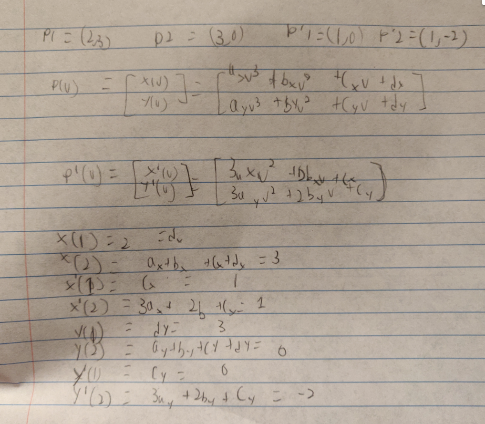
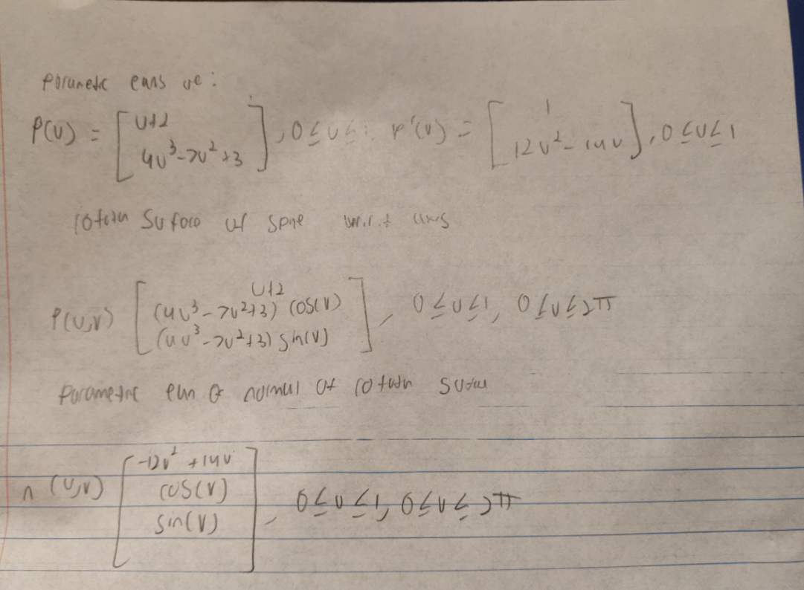
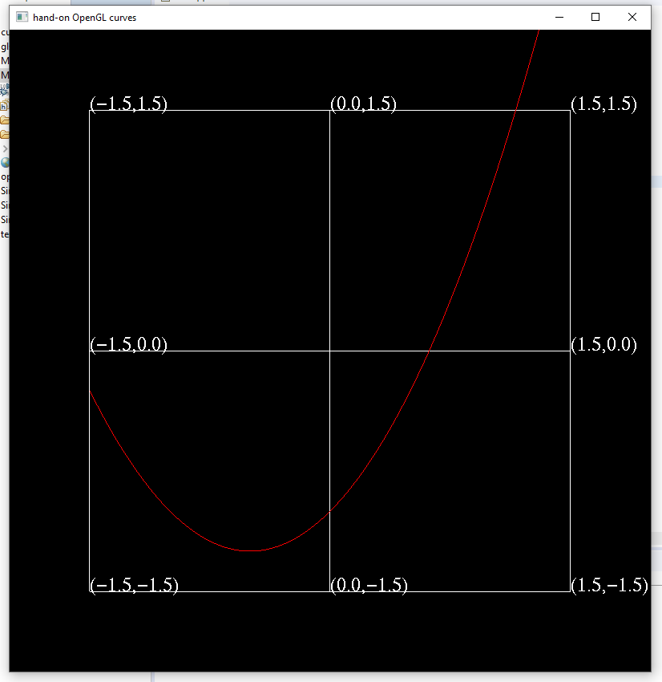
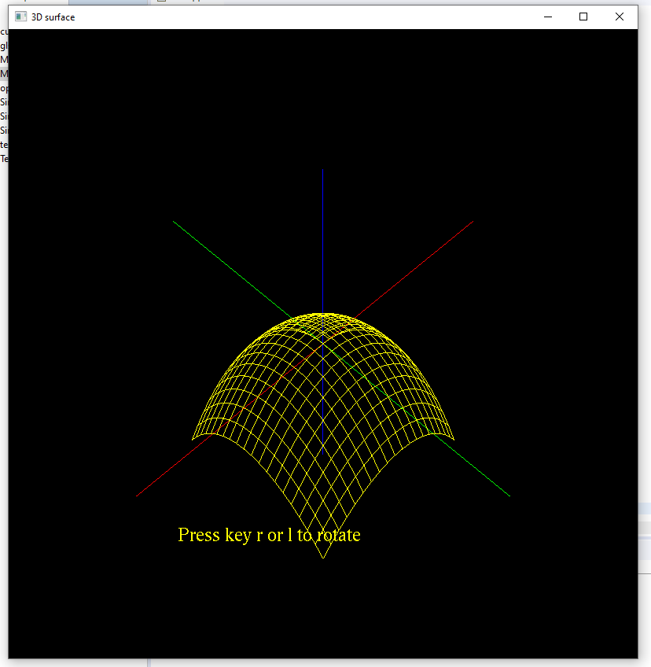
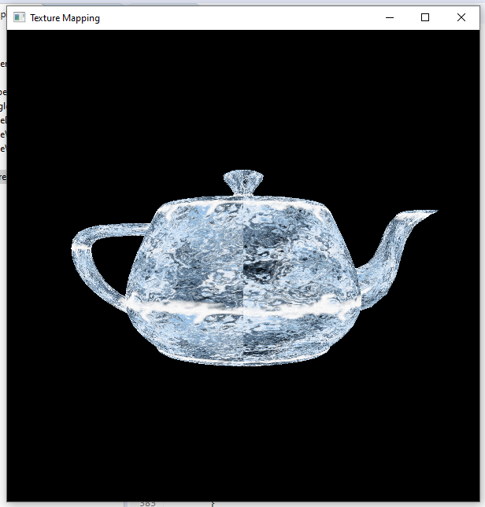

# A5 Report

Author: ??? (sign your name here)

Date: ???  (insert the date)

Check [readme.txt](readme.txt) for lab work statement and self-evaluation. 

## Q1 Curve and surface computing (short_answer)
	
### Q1.1 Cubic spline computing
{width=90%}
### Q1.2 Rotation surface and normal
{width=90%}

## Q2 Curve, surface, texture, GLSL (lab practice)
	
### Q2.1 Curve model and rendering
 
Complete? (Yes/No) 

If Yes, insert a screen shot image to show the completion.

{width=90%}

If No,  Add a short description to describe the issues encountered.

### Q2.2 Surface model and rendering
 
Complete? (Yes/No) 

If Yes, insert a screen shot image to show the completion.

{width=90%}

If No,  Add a short description to describe the issues encountered.

### Q2.3 Texture mapping
 
Complete? (Yes/No) 

If Yes, insert a screen shot image to show the completion.

{width=90%}

If No,  Add a short description to describe the issues encountered.

### Q2.4 GPU programming by GLSL
 
Complete? (Yes/No) 

If Yes, insert a screen shot image to show the completion.

{width=90%}

If No,  Add a short description to describe the issues encountered.

## Q3 SimpleView3 - texture, GLSL, curve, and surface (programming)
	
### Q3.1 Texture mapping basics
 

Complete? (Yes/No) 

If Yes, insert a screen shot image to show the completion.

[image caption](images/demo.png){width=90%}

If No, add a short description to describe the issues encountered.

### Q3.2 Solar system with texture mapping
 

Complete? (Yes/No) 

If Yes, insert a screen shot image to show the completion.

[image caption](images/demo.png){width=90%}

If No, add a short description to describe the issues encountered.

### Q3.3 Bezier curve
 

Complete? (Yes/No) 

If Yes, insert a screen shot image to show the completion.

[image caption](images/demo.png){width=90%}

If No, add a short description to describe the issues encountered.

### Q3.4 Rotation surface of Bezier curve
 

Complete? (Yes/No) 

If Yes, insert a screen shot image to show the completion.

[image caption](images/demo.png){width=90%}

If No, add a short description to describe the issues encountered.

### Q3.5 Phong shading by GLSL
 

Complete? (Yes/No) 

If Yes, insert a screen shot image to show the completion.

[image caption](images/demo.png){width=90%}

If No, add a short description to describe the issues encountered.

### Q3.6 My Graphics Library
 

Complete? (Yes/No) 

If Yes, insert a screen shot image to show the completion.

[image caption](images/demo.png){width=90%}

If No, add a short description to describe the issues encountered.

**References**

1. CP411 a5
2. Add your references if you used. 
